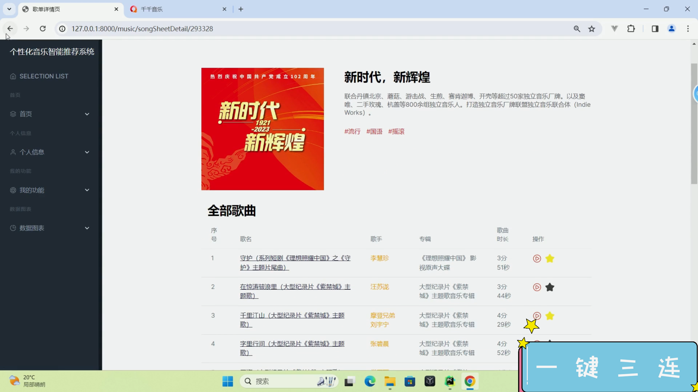
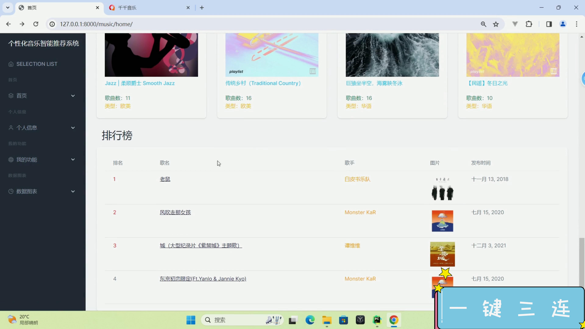
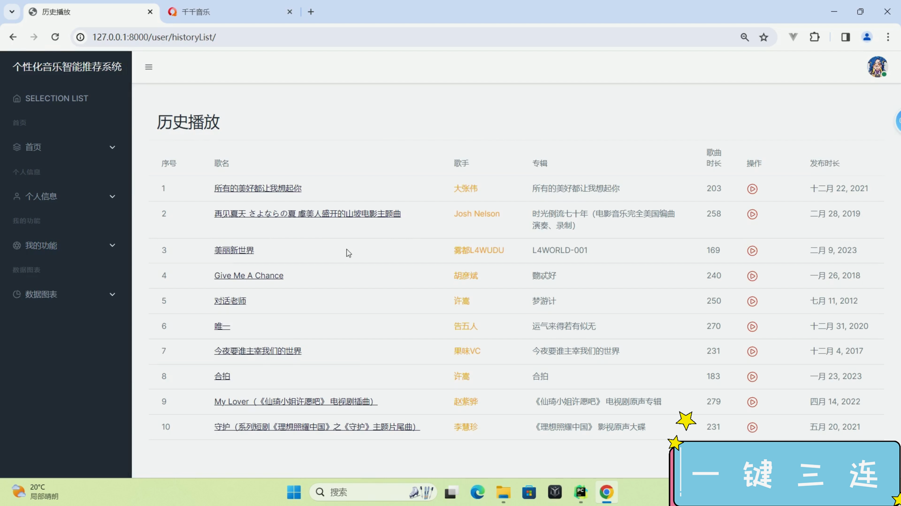
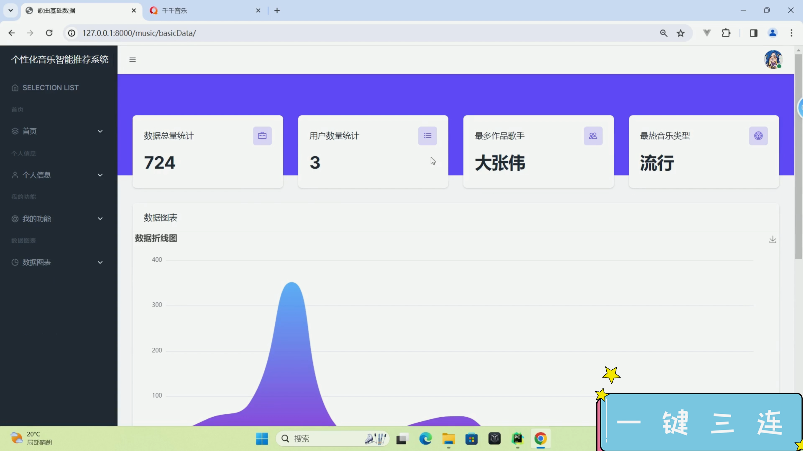
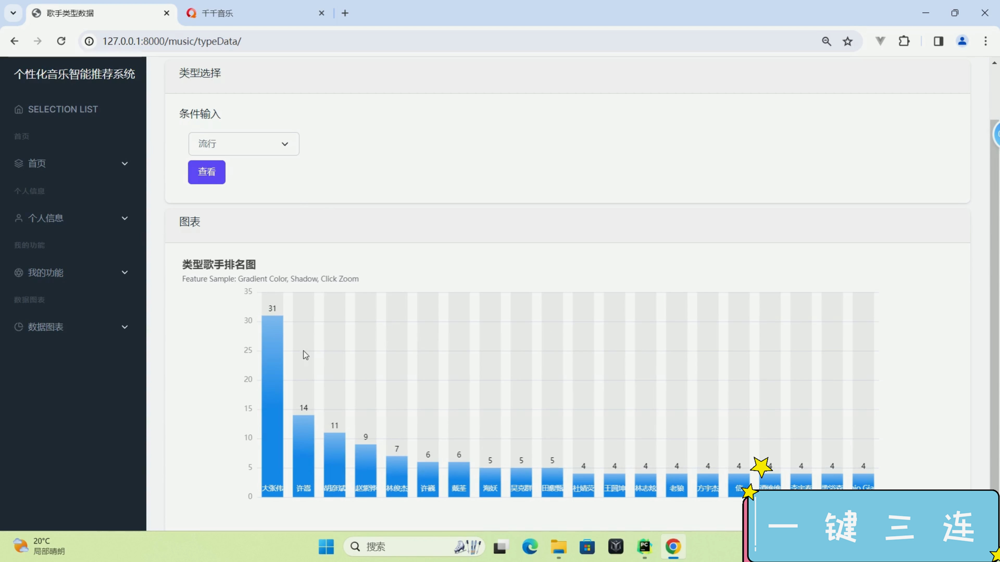
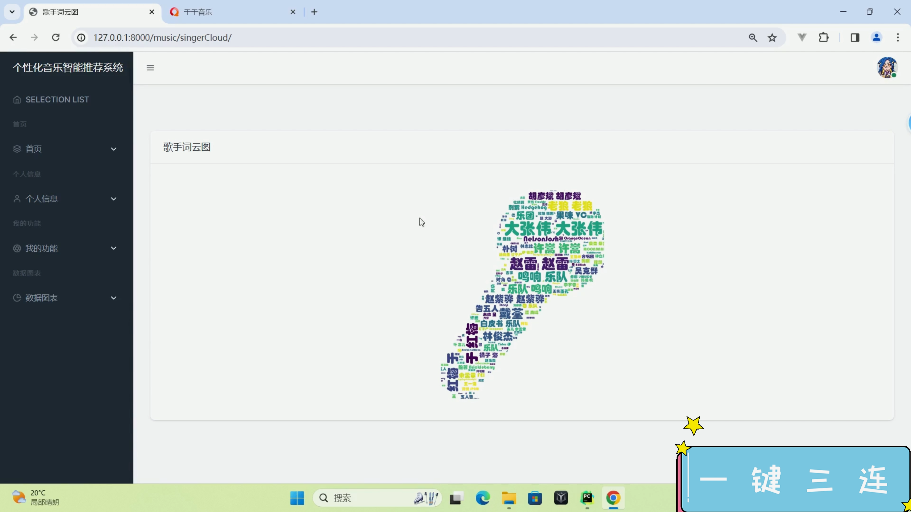
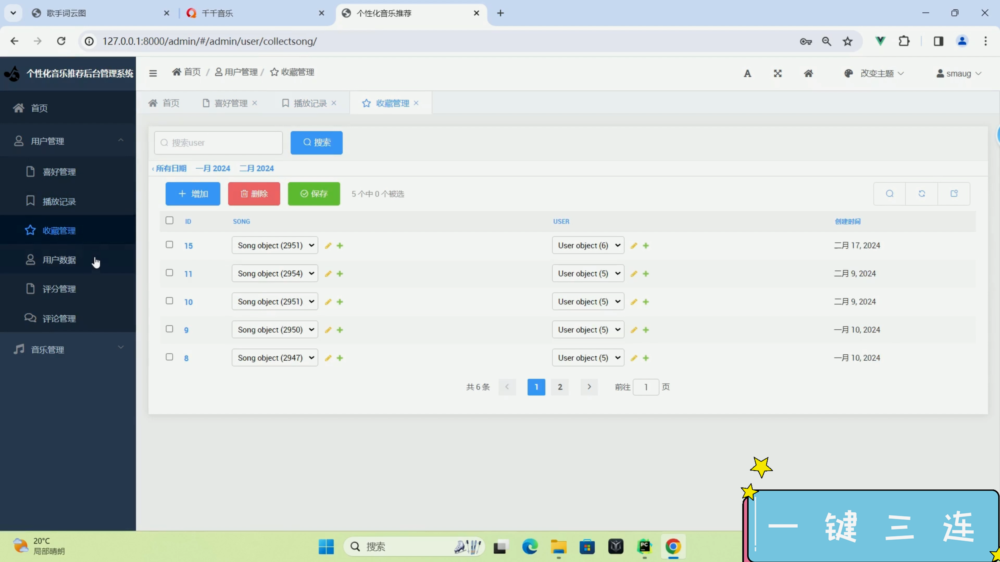
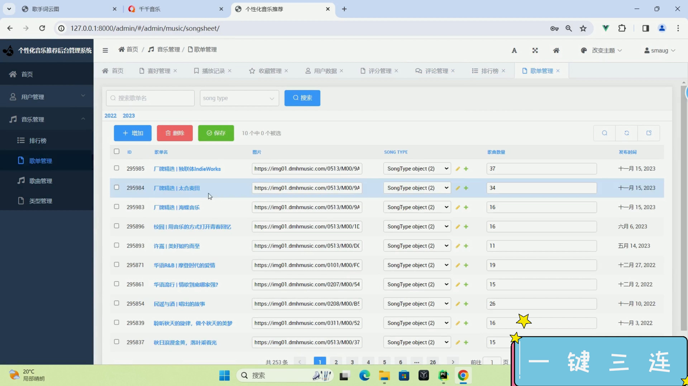

## 计算机毕业设计Django+CNN音乐推荐系统 机器学习 深度学习 音乐可视化 音乐爬虫 知识图谱 卷积神经网络推荐算法 大数据毕设

## 要求
### 源码有偿！一套(论文 PPT 源码+sql脚本+教程)

### 
### 加好友前帮忙start一下，并备注github有偿CNN音乐推荐
### 我的QQ号是2827724252或者798059319或者 1679232425或者微信:bysj2023nb 或bysj1688

# 

### 加qq好友说明（被部分 网友整得心力交瘁）：
    1.加好友务必按照格式备注
    2.避免浪费各自的时间！
    3.当“客服”不容易，repo 主是体面人，不爆粗，性格好，文明人。

## 功能介绍
技术栈：django、mysql、requests、基于物品协同过滤推荐算法、深度学习
开发技术介绍
前端框架：
HTML，CSS，JAVASCRIPT，Echarts
后端：Django
数据处理框架：Pandas
数据存储：Mysql
编程语言：Python/Scala
推荐算法：（1、ItemCF 2、
UserCF） Tensorflow CNN
数据可视化：Echarts

## 演示视频
https://www.bilibili.com/video/BV1X4421Q7Qz/?spm_id_from=333.999.0.0

## 截图

